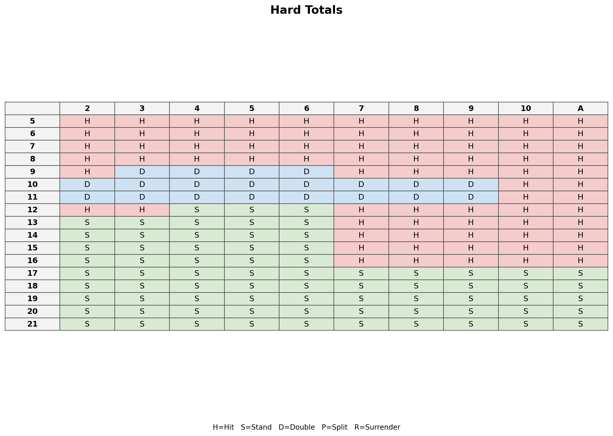

# Blackjack AI Engine

A probability-based Blackjack strategy engine that computes optimal player actions using **expected value (EV) analysis** and **dynamic programming (memoization)**.

The engine evaluates all available actions and recommends the one with the highest expected return under configurable casino rules.

---

# Features

### EV-Based Decision Engine
- Calculates optimal Blackjack decisions using **expected value**
- Dynamic programming with memoization for fast recursive evaluation
- Supports the following player actions:
  - Hit
  - Stand
  - Double
  - Split
  - Surrender

### Dealer Simulation
- Computes full **dealer outcome distributions**
- Supports:
  - S17 (dealer stands on soft 17)
  - H17 (dealer hits soft 17)

### Strategy Table Generator
Automatically generate full Blackjack strategy charts.

Outputs:
- CSV tables
- HTML tables
- Casino-style PNG strategy charts

### Explainable Strategy
Optional EV breakdown showing the expected value for every action.

### Rule Comparison
Compare how strategy changes under different rule sets.

Example comparisons:
- S17 vs H17
- No surrender vs late surrender

---

# System Architecture

```text
User Input / CLI
        │
        ▼
 ┌───────────────┐
 │   __main__.py │
 │ CLI Interface │
 └───────┬───────┘
         │
         ▼
 ┌────────────────┐
 │   strategy.py  │
 │ recommend_action
 └───────┬────────┘
         │
         ▼
 ┌────────────────┐
 │  ev_engine.py  │
 │ EV computation │
 └───────┬────────┘
         │
   ┌─────┴─────┐
   ▼           ▼
┌──────────┐ ┌──────────┐
│ dealer.py│ │ rules.py │
│ Dealer EV│ │ Rule set │
└────┬─────┘ └──────────┘
     │
     ▼
┌──────────┐
│ cards.py │
│ Card /   │
│ draw model
└──────────┘

Strategy Table Generation
         │
         ▼
 ┌────────────────┐
 │  tablegen.py   │
 │ CSV / HTML /   │
 │ PNG generation │
 └────────────────┘
 ```

 ### Module Responsibilities

- `__main__.py`  
  Handles CLI commands such as single-hand queries and strategy table generation.

- `strategy.py`  
  Converts user input into engine states and selects the highest-EV action.

- `ev_engine.py`  
  Core recursive expected value engine with memoization.

- `dealer.py`  
  Computes dealer outcome probability distributions.

- `rules.py`  
  Stores configurable casino rule settings such as S17/H17, surrender, and split rules.

- `cards.py`  
  Defines card representation and draw probabilities.

- `tablegen.py`  
  Generates full hard total, soft total, and pair strategy tables in CSV, HTML, and PNG formats.

---

# Project Structure
```
blackjack_ai
├── cards.py
├── dealer.py
├── deck_factory.py
├── ev_engine.py
├── rules.py
├── strategy.py
├── tablegen.py
└── main.py
```


Key modules:

| File | Purpose |
|-----|------|
| `ev_engine.py` | Core EV computation |
| `dealer.py` | Dealer outcome probabilities |
| `strategy.py` | Determines best action |
| `tablegen.py` | Generates strategy tables |
| `rules.py` | Configurable casino rules |
| `__main__.py` | CLI interface |

---

# Installation

```bash
git clone https://github.com/YOUR_USERNAME/blackjack-ai-engine
cd blackjack-ai-engine

python -m venv venv
source venv/bin/activate

pip install -r requirements.txt
```

Install optional visualization dependency:

```bash
pip install matplotlib
```

---

## Running Tests

```bash
pytest -q
```

---

## CLI Usage

**Query Optimal Action**

Example:
```bash
python -m blackjack_ai query "A,7 vs 9"
```
Example output:
```bash
['A', '7'] vs 9 -> hit
       hit: -0.018
      stand: -0.042
     double: -0.031
```

---

## Generate Strategy Tables

Generate CSV + HTML strategy tables:
```bash
python -m blackjack_ai table --csv --html --out outputs/strategy
```
Output:
```bash
outputs/strategy/
  hard_totals.csv
  soft_totals.csv
  pairs.csv
  strategy.html
```

---

## Generate Casino-Style Strategy Charts
```bash
python -m blackjack_ai table --png --out outputs/strategy
```
Output:
```bash
outputs/strategy/
  hard_totals.png
  soft_totals.png
  pairs.png
```

---

## Explain Mode (EV Breakdown)
Exports the EV for every possible action in each strategy cell.
```bash
python -m blackjack_ai table --explain --out outputs/explain
```
Output:
```
hard_totals_evs.csv
soft_totals_evs.csv
pairs_evs.csv
```

---

## Rule Comparison

Identify where strategy changes under different rules.

Example: compare **S17** vs **H17**
```bash
python -m blackjack_ai table --compare h17 --out outputs/compare_h17
```
Output:
```
flips_hard.csv
flips_soft.csv
flips_pairs.csv
```
These CSV files list the exact cells where optimal strategy changes.

---

## Example Strategy Chart

Generated automatically by the EV engine.



## Future Improvements

- Finite-shoe probabilities
- Card counting EV adjustments
- Strategy deviation detection
- Interactive web UI
- Monte Carlo validation
- GPU acceleration for large EV simulations

---

## Educational Purpose

This project demonstrates:

- dynamic programming
- probabilistic modeling
- recursive EV evaluation
- CLI design
- data visualization

It is intended as a **portfolio project for quantitative software engineering and algorithmic finance roles**.

---

## License

MIT License.